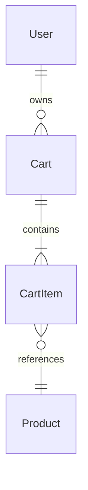

# Low-Level Design Document (LLD)

## Objective

This requirement enables customers to add products to their shopping cart, so they can purchase them later. The cart must reflect real-time updates for item quantity, price, and total cost, handle multiple additions of the same item, and persist cart contents across navigation and refresh. The backend must validate product existence and stock, and ensure high performance and security.

---

## 2. SpringBoot Backend Details

### 2.1. Controller Layer

#### 2.1.1. REST API Endpoints

| Operation                | REST Method | URL              | Request Body                  | Response Body               |
|-------------------------|-------------|------------------|-------------------------------|-----------------------------|
| Add item to cart        | POST        | /api/cart/add    | { productId, quantity }       | CartDTO                     |
| Get cart                | GET         | /api/cart        | -                             | CartDTO                     |
| Remove item from cart   | DELETE      | /api/cart/remove | { productId }                 | CartDTO                     |
| Update item quantity    | PUT         | /api/cart/update | { productId, quantity }       | CartDTO                     |
| Clear cart              | DELETE      | /api/cart/clear  | -                             | CartDTO                     |

#### 2.1.2. Controller Classes

| Class Name         | Responsibility                         | Methods                                  |
|-------------------|----------------------------------------|------------------------------------------|
| CartController     | Handles cart operations (add, get, etc)| addItem, getCart, removeItem, updateItem, clearCart |

#### 2.1.3. Exception Handlers
- GlobalExceptionHandler: Handles validation errors, product not found, out-of-stock, unauthorized access, etc.

---

### 2.2. Service Layer

#### 2.2.1. Business Logic Implementation
- CartService: Implements cart operations.
  - addItemToCart: Validates product existence and stock, adds/increments item.
  - getCart: Retrieves cart for session/user.
  - removeItemFromCart: Removes item.
  - updateItemQuantity: Updates quantity.
  - clearCart: Clears cart.

#### 2.2.2. Service Layer Architecture
- CartServiceImpl (implements CartService)
- ProductService (for product validation)

#### 2.2.3. Dependency Injection Configuration
- Services are annotated with @Service.
- Repositories are injected via @Autowired.

#### 2.2.4. Validation Rules

| Field Name   | Validation                       | Error Message                | Annotation Used      |
|--------------|----------------------------------|------------------------------|----------------------|
| productId    | Must exist in Product DB         | Product not found            | @ExistsInDatabase    |
| quantity     | Must be > 0 and ≤ stock          | Invalid quantity / Out of stock | @Min, @Max          |
| cart         | Must persist for session/user    | Cart not found               | -                    |

---

### 2.3. Repository/Data Access Layer

#### 2.3.1. Entity Models

| Entity    | Fields                                | Constraints                 |
|-----------|---------------------------------------|-----------------------------|
| Cart      | id, userId/sessionId, items[], total  | Unique per user/session     |
| CartItem  | id, productId, quantity, price        | productId exists, quantity ≥ 1 |
| Product   | id, name, price, stock                | stock ≥ 0                   |

#### 2.3.2. Repository Interfaces
- CartRepository: CRUD for Cart entity.
- ProductRepository: CRUD for Product entity.

#### 2.3.3. Custom Queries
- Find cart by userId/sessionId.
- Update item quantity in cart.
- Remove item from cart.

---

### 2.4. Configuration

#### 2.4.1. Application Properties
- spring.datasource.url
- spring.datasource.username
- spring.datasource.password
- spring.jpa.hibernate.ddl-auto
- session timeout, security token config

#### 2.4.2. Spring Configuration Classes
- WebSecurityConfig: Session token, CORS, HTTPS enforcement.
- CartConfig: Bean definitions for cart management.

#### 2.4.3. Bean Definitions
- CartService, ProductService, CartRepository, ProductRepository

---

### 2.5. Security
- Authentication mechanism: Secure session tokens (JWT or Spring Session)
- Authorization rules: Only authenticated users can access cart endpoints
- JWT/Token handling: Token validation filter, session persistence

---

### 2.6. Error Handling & Exceptions
- GlobalExceptionHandler: Maps exceptions to HTTP status codes
- Custom exceptions: ProductNotFoundException, OutOfStockException, CartNotFoundException
- HTTP Status codes mapping:
  - 404: Product not found
  - 409: Out of stock
  - 401: Unauthorized
  - 400: Validation error

---

## 3. Database Details

### 3.1. ER Model


### 3.2. Table Schema

| Table Name | Columns                      | Data Types           | Constraints           |
|------------|------------------------------|----------------------|-----------------------|
| cart       | id, user_id, total           | UUID, UUID, DECIMAL  | PK(id), FK(user_id)   |
| cart_item  | id, cart_id, product_id, quantity, price | UUID, UUID, UUID, INT, DECIMAL | PK(id), FK(cart_id), FK(product_id), quantity ≥ 1 |
| product    | id, name, price, stock       | UUID, VARCHAR, DECIMAL, INT | PK(id), stock ≥ 0    |

### 3.3. Database Validations
- Ensure product exists before adding to cart
- Ensure sufficient stock
- Cart item quantity ≥ 1

---

## 4. Non-Functional Requirements

### 4.1. Performance Considerations
- Support up to 10,000 concurrent users
- Add to cart ≤ 500ms
- Use Redis/Spring Session for cart persistence if scalability needed

### 4.2. Security Requirements
- Secure session tokens (JWT/Spring Session)
- HTTPS for all endpoints
- Input validation to prevent injection

### 4.3. Logging & Monitoring
- Log cart operations (add, remove, update)
- Monitor performance metrics (latency, errors)
- Use Spring Boot Actuator for health checks

---

## 5. Dependencies (Maven)

```xml
<dependency>
    <groupId>org.springframework.boot</groupId>
    <artifactId>spring-boot-starter-web</artifactId>
</dependency>
<dependency>
    <groupId>org.springframework.boot</groupId>
    <artifactId>spring-boot-starter-data-jpa</artifactId>
</dependency>
<dependency>
    <groupId>org.springframework.boot</groupId>
    <artifactId>spring-boot-starter-security</artifactId>
</dependency>
<dependency>
    <groupId>org.springframework.boot</groupId>
    <artifactId>spring-boot-starter-validation</artifactId>
</dependency>
<dependency>
    <groupId>org.springframework.boot</groupId>
    <artifactId>spring-boot-starter-actuator</artifactId>
</dependency>
<dependency>
    <groupId>org.springframework.session</groupId>
    <artifactId>spring-session-data-redis</artifactId>
</dependency>
```

---

## 6. Assumptions
- Cart is persisted per user/session.
- Product data is available in relational DB (can be adapted for NoSQL).
- Session token mechanism is used for authentication.
- Cart operations are atomic and transactional.
- Frontend communicates via JSON over HTTPS.

---

## LLD Filenames
- lld/lld_SCRUM-11692.md
